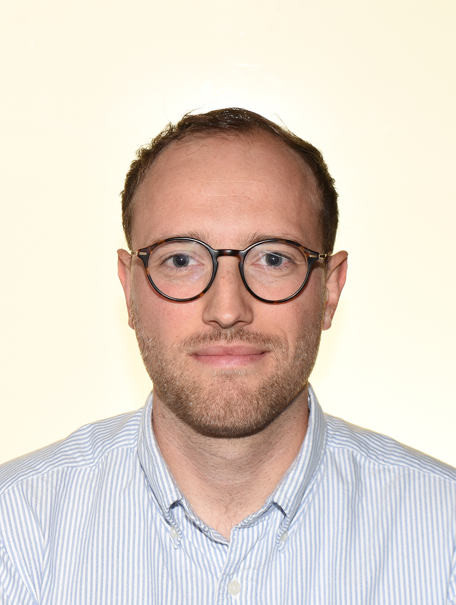

## Project lead (in alphabetical order)

{width="50%"}

[Robert Böhm](https://www.robertboehm.info/), Faculty of Psychology at the University of Vienna, Department of Psychology and Copenhagen Center for Social Data Science (SODAS), University of Copenhagen

{width="50%"}

[Lau Lilleholt](https://psychology.ku.dk/research/research_clusters/copsy/?pure=en/persons/630696), Department of Psychology and Copenhagen Center for Social Data Science (SODAS), University of Copenhagen

{width="75%"}

[Ingo Zettler](https://scholar.google.com/citations?hl=de&user=lyQCGAEAAAAJ&view_op=list_works&sortby=pubdate), Department of Psychology and Copenhagen Center for Social Data Science (SODAS), University of Copenhagen

## Student assistants

Josefine T. Meineche

Cecilie F. Strandsberg

Andreas Windfeld

Frederik C. Windfeld

## Collaborators

Mitja D. Back (University of Münster)

Cornelia Betsch (University of Erfurt)

Sarah Faber (Rotman Research Institute of Baycrest Centre, University of Toronto)

Lisa Felgendreff (University of Erfurt)

Jan Fousek (Institut de Neurosciences des Systèmes UMR INSERM 1106, Aix-Marseille Université)

Mattis Geiger (Ulm University)

Katharina Geukes (University of Münster)

Matthias Gondan (University of Innsbruck)

Daniel W. Heck (University of Marburg)

Viktor K. Jirsa (Institut de Neurosciences des Systèmes UMR INSERM 1106, Aix-Marseille Université)

Tabea H. Kaufmann (University of Marburg)

Lara Kroencke (University of Münster)

Anthony R. Mcintosh (Rotman Research Institute of Baycrest Centre, University of Toronto)

Morten Moshagen (Ulm University)

Spase Petkoski (Institut de Neurosciences des Systèmes UMR INSERM 1106, Aix-Marseille Université)

Lotte Pummerer (Leibnitz-Institut für Wissensmedien, Tübingen)

Franziska Rees (Ulm University)

Ana P. Santana (University of Copenhagen)

Kai Sassenberg (Leibnitz-Institut für Wissensmedien, Tübingen & University of Tübingen)

Christoph Schild (University of Siegen)

Kelly Shen (Rotman Research Institute of Baycrest Centre, University of Toronto)

Till Utesch (University of Münster)

Huifang Wang (Institut de Neurosciences des Systèmes UMR INSERM 1106, Aix-Marseille Université)

Oliver Wilhelm (Ulm University)

Kevin Winter (Leibnitz-Institut für Wissensmedien, Tübingen)

Marmaduke Woodman (Institut de Neurosciences des Systèmes UMR INSERM 1106, Aix-Marseille Université)
